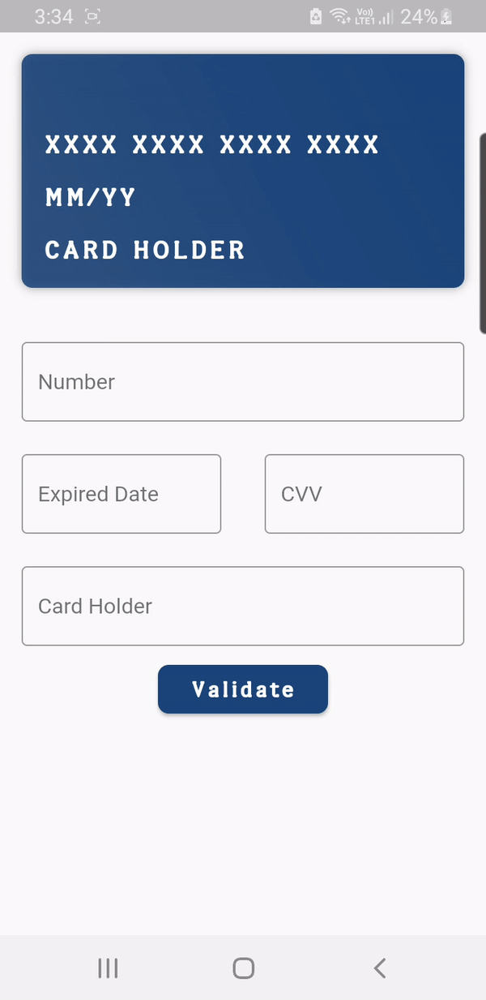

# Flutter Credit Card

A Flutter package allows you to easily implement the Credit card's UI easily with the Card detection.

## Preview

<p>
    
</p>

## Installing
1. Add dependency to `pubspec.yaml`

    *Get the latest version in the 'Installing' tab on pub.dartlang.org*
    
```dart
dependencies:
    flutter_credit_card: 0.1.0
```

2. Import the package
```dart
import 'package:flutter_credit_card/flutter_credit_card.dart';
```

3. Adding CreditCardWidget

    *With required parameters*
    ```dart
    CreditCardWidget(
        cardNumber: cardNumber,
        expiryDate: expiryDate, 
        cardHolderName: cardHolderName,
        cvvCode: cvvCode,
        showBackView: isCvvFocused, //true when you want to show cvv(back) view
    ),
    ```
    
   *With optional parameters*
    ```dart
    CreditCardWidget(
        cardNumber: cardNumber,
        expiryDate: expiryDate,
        cardHolderName: cardHolderName,
        cvvCode: cvvCode,
        showBackView: isCvvFocused,
        cardbgColor: Colors.black,
        height: 175,
        textStyle: TextStyle(color: Colors.yellowAccent),
        width: MediaQuery.of(context).size.width,
        animationDuration: Duration(milliseconds: 1000),
        ),
    ```

## How to use
Check out the **example** app in the [example](example) directory or the 'Example' tab on pub.dartlang.org for a more complete example.

## Getting Started

This project is a starting point for a Dart
[package](https://flutter.dev/developing-packages/),
a library module containing code that can be shared easily across
multiple Flutter or Dart projects.

For help getting started with Flutter, view our 
[online documentation](https://flutter.dev/docs), which offers tutorials, 
samples, guidance on mobile development, and a full API reference.

## Credit

This package's animation is inspired from from this [Dribbble](https://dribbble.com/shots/2187649-Credit-card-Checkout-flow-AMEX) art.
